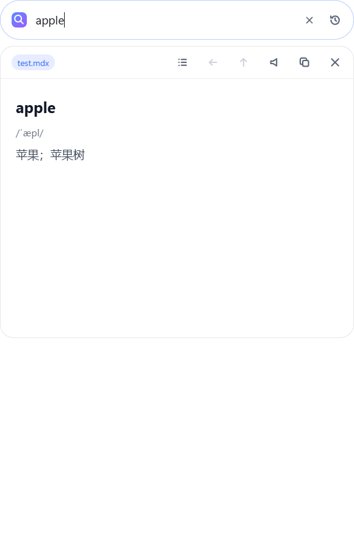
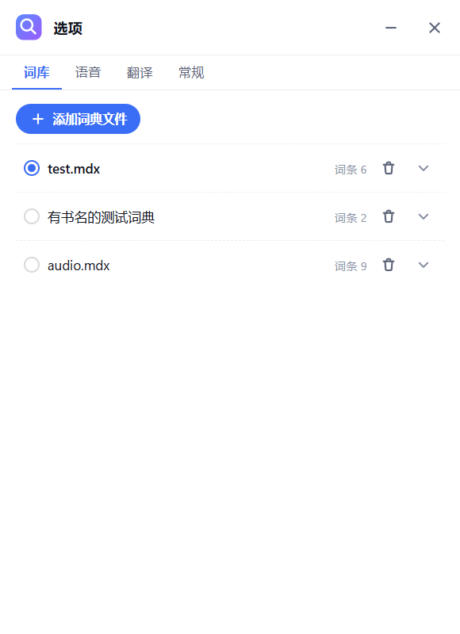
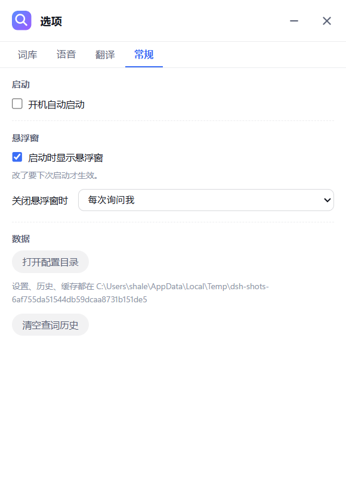
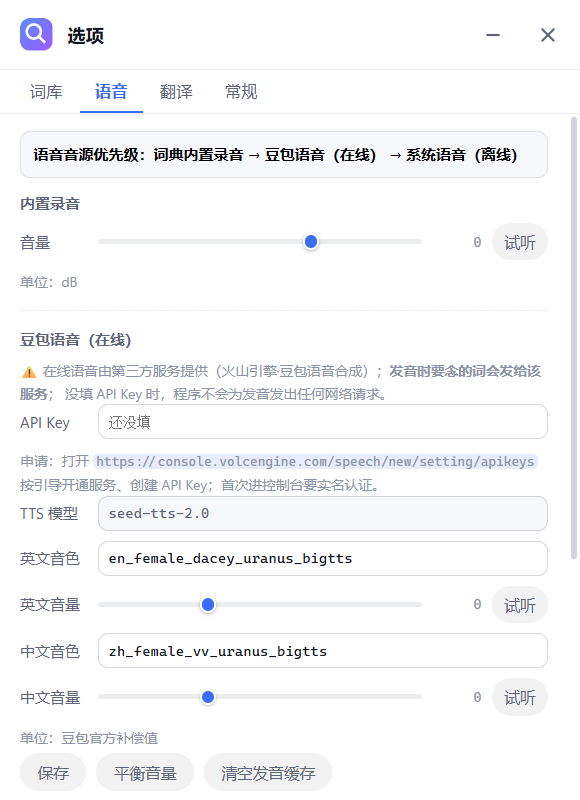

# LookupApp

> 一个 Windows 桌面查词工具：读 **MDict 词典**（`.mdx` / `.mdd`），浮窗取词、词条发音、机器翻译、
> 查词历史、词库管理。本仓库是 **0.2.1** 的源码 —— **C11 内核 + C# 外壳 + WebView2 界面**。
>
> 本仓库是**唯一的开发仓库**：版本用 Git 提交、标签与 Release 区分，不再按版本复制整棵工程目录。



## 它做什么

| 功能 | 说明 |
| --- | --- |
| **浮窗查词** | 常驻小窗，输入即查；正文里的链接、选中文字都能接着查；窗口能吸边、能收成胶囊 |
| **词库管理** | 导入 / 移除 `.mdx`、多本词典共存、拖动排序、逐本展开看路径与大小、当前词典切换 |
| **发音** | 三层音源，**顺序由内核定、用户不用选**：**词典自带录音**（`.mdd` 里的原录音）→ **在线语音**（要自备凭据，没填 Key 就用不上）→ **系统语音**（离线合成，没有网络也能念） |
| **机器翻译** | 整词或整段译文，作为「伪词条」查到（需自备凭据，默认不联网） |
| **查词历史** | 记录「词条 + 词典」，能回放；词典被移走 / 文件丢了会如实说明并给出恢复办法 |
| **兜底通道** | 当前词典查不到时自动去别的词典「借查」，问不到才说没有 —— **「没问完」与「没有」绝不含糊** |
| **托盘** | 托盘菜单（唤出胶囊 / 选项 / 退出）、查词窗与选项窗的键盘操作 |

<details>
<summary>界面截图（点开看）</summary>

| 词库 | 常规 |
| --- | --- |
|  |  |

| 语音 | 翻译 |
| --- | --- |
|  |  |

</details>

## 怎么装

**免安装（推荐）**：到本仓库的 Releases 下载 `LookupApp-0.2.1-portable.zip`，解压到任意目录，
双击 `LookupApp.exe` 即可。配置与缓存写在 `%APPDATA%\LookupApp`。

**系统要求**

- Windows 10 / 11（x64）
- **Microsoft Edge WebView2 Runtime** —— Windows 11 自带；Windows 10 若没装过，去
  [微软官网](https://developer.microsoft.com/microsoft-edge/webview2/) 装一次（Evergreen 版）
- 不需要安装 .NET Framework（Windows 10/11 自带 4.8）

第一件事通常是「选项」→「词库」里导入你自己的 `.mdx` 词典；程序**不附带任何词典**。

## 能读哪些词典文件

- `.mdx`（词条库）、`.mdd`（资源库：图片 / 音频 / 样式）
- **不带 `.mdd` 的词典**：`.mdx` 旁边散放的 `.css` / 字体 / 图片 / **`.js`** 也能读
  （样式与图片**先从 `.mdd` 里找**，里面没有才去旁边找）。
  ⚠️ 放行的只有 `.js`；`.mjs` / `.html` / `.htm` **不放行**（词典是外部内容，信任边界只有一条）。
  设计依据见 [`docs/design/不带mdd的词典与机器翻译开发指导.md`](docs/design/不带mdd的词典与机器翻译开发指导.md)。
- **加密与压缩的词典**：`Encrypted=1`（记录块）/ `Encrypted=2`（键信息块）、以及 zlib / LZO / 不压缩
  三种词块都能读 —— 支持的**真实范围**不靠文档声称，靠**格式矩阵对照测试**钉住
  （21 本合成词典覆盖「版本 × 压缩 × 编码 × 加密 × 索引形态 × 结构」，
  见 [`tools/golden/fixtures.txt`](tools/golden/fixtures.txt)；其中 20 本与冻结基线逐字节相同，
  1 本有 2 处**责任在参考实现**的已知差异，逐条记在
  [`tools/golden/compare-golden.py`](tools/golden/compare-golden.py) 的 `WHITELIST` 里）。

## 从源码构建

**工具链**：Node.js（前端与接口代码生成）、.NET SDK 或 MSBuild（编壳，目标框架 `net48` / x64）、
WSL + MinGW-w64（交叉编译出 Windows 内核 DLL）。版本要求、安装命令与预检见
[`native/README.md`](native/README.md)。

```powershell
node web/build.mjs                     # 打前端（改 web/ 后必做）
node tools/gen-bindings.mjs             # 从接口定义重新生成 4 份接口代码（改 abi/ 后必做）

# 内核：编 + 接口自检 + 单元测试（默认走 WSL 里的 gcc）
powershell -NoProfile -ExecutionPolicy Bypass -File tools\native-build.ps1
powershell -NoProfile -ExecutionPolicy Bypass -File tools\native-build.ps1 -Asan   # ASan + UBSan

# 交叉编出 Windows 内核 DLL（改内核后必做）
wsl.exe -- bash tools/build-windows-dll.sh /mnt/c/<本仓库的 WSL 路径> Release

& "$env:USERPROFILE\.dotnet\dotnet.exe" build shell\Lookup.App\Lookup.App.csproj -c Release
                                       # 编壳（产物：shell\Lookup.App\bin\Release\net48\Lookup.App.exe）
```

跑起来看效果：把编出来的 `Lookup.App.exe`、`dsh_lookup.dll` 与 `web\` 摆在一起即可 ——
⚠️ `web\` 与 exe 的相对位置别弄错（外壳是从 exe 所在目录**往上**找 `web/floating.html` 的）。
要一个装好的便携包就跑 `powershell -File tools\package.ps1`。

## 怎么验（本项目有五道分级检查 + 一道打包验收）

判断标准只有一句：**这条测试需要什么才能判，就放在哪一级**；**能用一句话说清"这次只影响哪一层"，
就不许去跑最贵的那一级**。

| 级别 | 判什么 | 入口 |
| --- | --- | --- |
| **A 静态 / 决定类**（秒级、不启动程序） | 接口定义与四份生成物一致；界面结构（页签 / 控件归属 / 删掉的东西不许回来 / 页面调的桥方法名壳认不认） | `node tools/gen-bindings.mjs --check` **+** `node tools/ui-static-check.mjs` |
| **A′ 授权边界**（秒级、不启动程序） | 词典脚本伪造不出一条「翻译」动作 | `node tools/check-entry-auth.mjs` |
| **B 纯逻辑**（不启动程序） | 内核单元测试 | `wsl.exe -- bash tools/wsl-make-test.sh`；内存检查 `make asan`（ASan + UBSan，**不许跳**） |
| **C 对照 / 单点交互** | 与参考实现逐字节对照；渲染进程的定向观察 | `powershell -File tools\golden-gate.ps1`；`node tools/probe-page.mjs --help` |
| **D 端到端** | 真实窗口 → 真实页面 → 通信桥 → 内核；真 DLL + 绑定 | `powershell -File tools\test-shell-app.ps1`；`powershell -File tools\test-windows-dll.ps1` |
| **打包** | 便携包重建并验证（最后几步就是验） | `powershell -File tools\package.ps1` |

⚠️ **默认不是完整测试**。改文案只重打前端；纯逻辑只跑内核单测；跨模块 / 窗口几何 / 启动路径才跑 D 级。
每道检查的原始输出一律写进 `logs/`（已 gitignore）。

## 仓库结构

```
abi/lookup.abi.json   ← 唯一的接口定义（函数 / 枚举 / 常量；注释里写着业务约定）
        │
        ├─ node tools/gen-bindings.mjs ─→ native/include/dsh_lookup.h        （C 头文件）
        │                                 shell/Lookup.Interop/DshLookup.g.cs（C# 绑定）
        │                                 web/src/shared/abi.ts              （TypeScript 类型）
        │                                 docs/api/abi.md                    （可读版）
        │
native/src/**（C11 内核：解析 / 查词通道 / 设置 / 历史 / 发音 / 翻译 …，零第三方依赖）
        │
        └─ dsh_lookup.dll ─→ shell/**（操作系统相关的那一半 + 真实程序）
                             web/**（界面）
```

| 路径 | 是什么 |
| --- | --- |
| `abi/` | **唯一的接口定义**（改它必须跑 `node tools/gen-bindings.mjs`） |
| `native/` | C11 内核：`src/**`、`include/dsh_lookup.h`（自动生成）、`tests/**`（单元测试）、`vendor/speex/`（第三方，BSD 3-Clause） |
| `shell/` | `Lookup.Interop`（自动生成的绑定）、`Lookup.Host`（通信桥 / 虚拟主机 / 平台能力）、`Lookup.App`（窗口） |
| `web/` | 界面（HTML / CSS / TypeScript）+ `build.mjs` |
| `testdata/` | **冻结的合成测试用词典**（`.mdx` / `.mdd` + `variants/` 格式矩阵），按 `SHA256.txt` 校验 |
| `reference/` | **只读的参考实现**（上一代 C# 解析器的一份冻结副本），只给对照测试当标准答案 |
| `tools/` | 构建 / 生成 / 诊断 / 验收 / 打包脚本（命令见 `AGENTS.md`） |
| `docs/` | `design/`（设计依据）、`adr/`（架构决策记录）、`api/abi.md`（自动生成）、安全审查报告 |
| `release/screenshots/` | 上面那几张截图 |

**为什么这么分**：业务逻辑只在 C 内核里，界面只是视图层，外壳只做「操作系统能力」那一半
（探本机音色、发 HTTP、摆窗口）—— **同一件事不许有两个来源**。内核是纯 C11、不依赖系统，
所以它能在 Linux 里编、也能交叉编译成 Windows DLL。

**为什么 `reference/` 也在仓库里**：对照测试要拿一个**独立于被测实现**的标准答案。参考实现
只读、不参与产品构建，`tools/golden/` 的三个 C# 工程把它链进来（不复制源码）。它存在的意义是
「**不能由正在被测的 C 实现重生成自己的标准答案**」—— 详见
[`reference/0.1.3-parser/README.md`](reference/0.1.3-parser/README.md)。

## 已知限制

1. **只支持 Windows**。内核（`native/`）是纯 C11、可移植；但外壳（C# / WinForms）与界面目前只有
   Windows 那一份实现。
2. **在线发音与机器翻译需要自备凭据**（火山引擎 / 豆包的 API Key 与音色），按量计费。
   没填就**置灰并说明原因**，绝不不报错地失败。凭据只存在用户自己的设置里，仓库里不含任何 Key。
3. **不附带任何词典**。词典版权属于各自的作者。
4. 界面用 WebView2 渲染，所以外观与行为跟着系统上装的 Edge 内核走。
5. **格式支持范围以对照测试为准**，不以文档声称的为准：`docs/design/` 里那些设计文档写的是
   *打算怎么做*，`tools/golden/fixtures.txt` 那 21 本合成词典才是*实际验过什么*。

## 关于本仓库

- 本仓库是 **0.2.1**；`CHANGELOG.md` 记用户看得见的变化，`AGENTS.md` 记开工与验收的规矩。
- 本仓库**含**测试、测试用词典与验收 / 打包脚本 —— 开发与验收都在这一个目录里完成。
- 代码注释里偶尔会看到「参考实现」这个说法：指的是上一代的 C# 实现，它的解析器一份**冻结副本**
  收在 `reference/0.1.3-parser/`（只读），本版内核是拿它当标准答案逐字节对照移植过来的。
- 本仓库不含任何凭据；在线发音与机器翻译一律要你自己申请、自己填。

## 许可

本项目以 **MIT 许可**发布，见 [`LICENSE`](LICENSE)。第三方组件与它们的许可见
[`THIRD-PARTY.md`](THIRD-PARTY.md)（其中 libspeex 1.2.1 是 BSD 3-Clause，只用了它的解码路径）。
